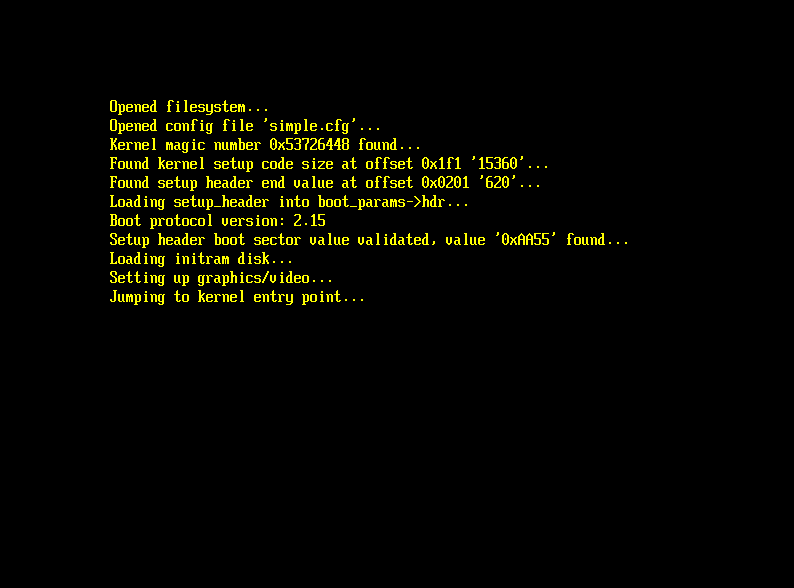

# Unified Extensible Firmware Interface (UEFI) Linux Bootloader
A UEFI Bootloader made for Linux, this bootloader implements the 64-bit Boot Protocol for Linux.





# Features
- Initial ramdisk support
- Interative boot menu
- ACPI support (coming soon)
- UEFI 2.70 support

# Tools and Resources

I was going to initially use GNU-EFI and GCC for this project however i decided to use the following tools for more flexibility:

- Clang
- LLVM Linker
- QEMU
- OVMF


# Creating a Hello World EFI Program

To begin writing a bootloader I needed to write a simple "Hello World!" program, In order to do this I created a header file with the necessary definitions as per the [UEFI Specification (Might be outdated depending on when your reading this)](https://uefi.org/sites/default/files/resources/UEFI_Spec_2_10_Aug29.pdf)
. By creating this header it gives us (the programmer) an easy way to interface with the computers underlying UEFI firmware and access it's functions and runtime services. I defined everything in the [uefi_structures.h](https://github.com/programmer838/Bootloader/blob/main/uefi_structures.h) file, it contains various data types, structs, function pointers and much more.

```
#include "uefi_structures.h"

EFI_STATUS
EFIAPI
efi_main(EFI_HANDLE ImageHandle, EFI_SYSTEM_TABLE *SystemTable)
{
    EFI_STATUS Status = SystemTable->ConOut->OutputString(SystemTable->ConOut, L"Welcome to Qasim's EFI Program.\n");
    return Status;
}
```

# Setting up the running and testing environment

Whilst developing this I utilised Qemu which is a free and open-source emulator to run my bootloader and test it. Below I will detail the setup process incase you want to develop your own bootloader:

1) Installing QEMU - ```sudo apt-get install qemu```
2) Installing OVMF - ```sudo apt-get install ovmf```, OVMF will provide our QEMU virtual machine with UEFI firmware
3) Create an empty disk image file - ```dd if=/dev/zero of=disk.img bs=1M count=200```, Whilst developing a UEFI bootloader we need to emulate something known as a EFI partition (also known as ESP partition), this is a special partition which contains the necessary files
our bootloader needs and is correctly structured for the computer to find and run the bootloader.
4) Format the disk with FAT32 filesystem - ```sudo mkfs.vfat -F 32 disk.img```
5) Mount the disk - ```sudo mount -o loop disk.img mnt```
6) Structure the disk - ```cd mnt``` - ```touch simple.cfg``` - ```mkdir -p EFI/BOOT```
7) Launch QEMU ```qemu-system-x86_64 -bios /usr/share/OVMF/OVMF_CODE.fd -hda disk.img```


# Bootloader configuration file

The bootloader uses a configuration file which is reads to determine which kernel image and initrd image to use:

- The configuration file should be named 'simple.cfg' and placed in the root of the EFI partition
- The configuration file should contain a single line in the following format:
```LinuxKernelImageName#InitRDFileName```
- ```LinuxKernelImageName``` should be the name of the kernel image
- Next it should be followed by a single hash ```#```
- ```InitRDFileName``` should be the name of the initrd file name


# Steps for booting the kernel

1) **Calculate real-mode code size**: The real-mode code is a part of the kernel image which contains code that runs in real mode. In the Linux kernel the real-mode code is made up of the boot-sector portion and the setup-code portion. The size of the boot-sector portion is always 512 bytes. The size of the setup-code portion can be obtained by reading at offset 0x1f1 into the kernel image, which gives the size of the setup-code in 512 byte sectors. If the value read is 0, then  change it to 4. Then finally multiply this by 512. Using this information we can calculate the size of the real-mode code by adding both the boot-sector portion size and the setup-code portion size.

2) **Load the setup-header**: The setup-header is a section within the kernel image which contains various peices of information required by the bootloader whilst loading and setting up the kernel for booting. The setup header needs to be loaded into the boot_params structure which is essentially a structure that the kernel uses to access various peices of information provided by the bootloader, when allocating memory for boot_params the memory should be zero-initialised. The hdr field of boot_params (boot_params->hdr) must be loaded with the setup-header. The setup header can be found starting at offset 0x1f1 in the kernel image and ending can be calculated using the formula '0x0202 + byte value at offset 0x0201'.

3) **Initialise boot_params->hdr**: The hdr field contains various fields which in some cases can be filled out, some of the key ones include cmd_line_ptr which is a pointer to a string which specifies 'command line parameters' that can be passed to the kernel whilst booting in order to customise cerain aspects of the booting process. A common use for this is to specify the where the root filesystem should be mounted during the booting process by specifying for example 'root=/x/y/part1'. Some other common fields to set are the vid_mode field, which can be used to specify the video mode the kernel should use during the booting process, the default video mode value is 0xffff. Lastly the type_of_loader field which can be used to specify a unique value that can identify the bootloader to the kernel, a default value of 0xff is normally set here.

4) **Loading and set up initrd**: Initrd also known as the initial ramdisk is a scheme used to mount and load a temporary filesystem which will be used by the kernel during the booting process and to set up the actual root filesystem. For this step we must load the initrd file into memory in a contiguous block of memory and update the boot_params fields associated with the initial ramdisk such as boot_params->hdr->ramdisk_size which contains the size of the initrd image and boot_params->hdr->ramdisk_image which stores the address where the initrd image is loaded in memory.


5) **CPU in 64-bit mode**: Using 64 bit OVMF firmware so this is fine
6) **Enable paging**: UEFI enables paging by default so this is fine
7) **Kernel, boot_params and cmdline should be identity mapped** (physical and virtual memory addresses should be identical): AllocatePages() and AllocatePool() use identity mapped paging by default so this is fine


8) **Add dummy GDT (Global Descriptor Table) with descriptors**:

## GDT (Global Descriptor Table)

A GDT (Global Descriptor Table) is a table in memory used by operating systems to reference various peices of information about memory segments. A memory segment is simply a chunk of memory, different segments could be used for different things in the operating system.

An entry in the GDT is known as a descriptor, a descriptor can be thought of as an object of sorts which contains information about a specific segment. Descriptors normally include information such as:

- The base address of the segment
- The size of the segment
- The permissions associated with the segment

However in long mode (64-bit mode) the GDT values related to the size of a segment or bounds are largely ignored, instead the main use of the GDT is to reference permission and privilege information about memory segments. 

As per the [64-bit boot protocol](https://www.kernel.org/doc/html/v5.4/x86/boot.html#id1) The GDT must be loaded with 2 descriptors, each of size 4GB and each one should be a 'flat segment', this essentially means that we must use a 'flat memory model'.

A flat memory model is essentially a memory model where memory is treated as a single contiguous address space. So this means the two segments descriptors we add to the GDT will both have a base address (start address) of 0. But as mentioned previously the size and bounds information of segments is ignored in 64-bit mode, so how are memory limits and allocations and sizes of chunks of memory handled if long mode does not use the limit and base values of the GDT descriptors?

Well this is handled using paging. Paging is a memory management scheme where a layer of abstraction is added on top of physical memory addresses with virtual memory addresses. In essense different physical addresses map to different virtual addresses and by adding this layer, the computer is able to effectively map a number of X physical addresses to some virtual addresses wthout the need for the physical addresses being contiguous and next to each other, instead the virtual addresses makes it seem like the addresses are in fact contiguous.

## Segment selectors

The two descriptors that should be added to the GDT are the CS (code segment) and DS (data segment) descriptors
__BOOT_CS(0x10) and __BOOT_DS(0x18) however what are the numbers 0x10 and 0x18? these are known as segment selectors are are 16-bit values which allow us to essentially offset into the GDT, various bits of the segment selector represent different pieces of information and we need to check what the segment descriptors 0x10 and 0x18 represent so we can add the CS and DS descriptors in the correct index in the GDT.

Starting with the CS segment selector 0x10:
- 0x10 as a 16 bit binary value is 0000000000010000
- The last 2 bits represent the requested privilege level (RPL)
- The first 13 bits represent the index into the GDT (Index)
- The remaining bit signifies if the GDT or the LDT is used (0 for GDT)
```
Index          TI  RPL
0000000000010   0   00
```
So in this in the GDT we must add a segment descriptor at index 0000000000010 aka 2


Similarly with the DS segment selector 0x18:
```
Index          TI  RPL
0000000000011   0   00
```

So in this in the GDT we must add a segment descriptor at index 0000000000011 aka 3
