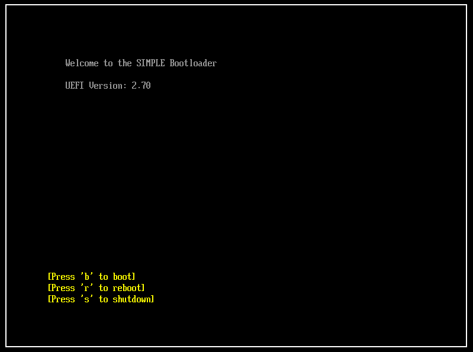

# Unified Extensible Firmware Interface (UEFI) Linux Bootloader
A UEFI Bootloader made for Linux, this bootloader implements the 64-bit Boot Protocol for Linux.




# Features
- Initial ramdisk support
- Interative boot menu
- ACPI support
- UEFI 2.70 support

# Tools and Resources

I was going to initially use GNU-EFI and GCC for this project however i decided to use the following tools for more flexibility:

- Clang
- LLVM Linker
- QEMU
- OVMF

# Bootloader configuration file

The bootloader uses a configuration file which is reads to determine which kernel image and initrd image to use:

- The configuration file should be named 'simple.cfg' and placed in the root of the EFI partition
- The configuration file should contain a single line in the following format:
```LinuxKernelImageName#InitRDFileName```
- ```LinuxKernelImageName``` should be the name of the kernel image
- Next it should be followed by a single hash ```#```
- ```InitRDFileName``` should be the name of the initrd file name
